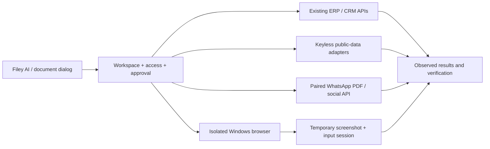

# Advanced Filey AI update

## What changed

Filey AI now displays a task checklist and live tool results for normal and
autonomous conversations. Follow-up messages retain the conversation. Delegated
tasks inherit the parent's instructions, share duplicate-write protection, and
cannot recursively delegate or prematurely complete the parent task.

Malformed tool arguments are rejected before execution. Cancellation prevents
remaining tools and late approvals from running. Successful edits invalidate
cached reads so verification sees fresh results. A task with unfinished checklist
items cannot use the autonomous completion tool unless it reports itself blocked.
Saved skills, memory and prior outcomes provide continuity; this does not train
model weights or rewrite Filey's code.

## Computer access

The Windows desktop build has a native tool for window listing, screenshots,
clicks, typing, scrolling and a limited set of keyboard keys. Enable it explicitly
for five minutes in Filey AI. Each input is tied to a recent, single-use screenshot.
Stop, expiry, leaving the chat or changing workspace revokes access.

Screenshots are sent as image input to the selected model and removed from later
requests after observation. Image bytes are not saved in chat history or the run
journal. This requires a model that understands images and tools. Browser builds
explain the desktop requirement and leave the enable control disabled.

See [computer access setup and limits](computer-use.md).

## WhatsApp and other channels

### Connected work architecture

The same agent run handles direct Filey actions, public research and desktop interaction. It discovers specialist tools on demand, records its plan/results, and applies workspace identity, owner access and approval checks before execution. It does not need another orchestration server.

- **Integrations → Free work tools** runs market-data, supported-holiday and licensed-image lookups. `work_service` exposes the same adapters to AI; returned source/rights metadata stays with the result. [Services, limits and verified sources](free-work-services.md).
- **Browser** manages real Windows WebView2 windows. `workspace_browser` returns window IDs; `computer_use` observes and operates them under temporary access. Login and CAPTCHA remain user actions. Local/cloud modes retain the account/company browser profile; switching workspaces closes the active windows. [Browser isolation and compatibility](desktop-browser.md).
- **Invoice sharing** resolves one invoice and its customer before rendering. Direct `send_invoice_whatsapp` uploads the PDF and waits for acceptance. `prepare_invoice_whatsapp` saves that PDF and opens an explicitly unsent draft with its local path; attaching and sending are separate, observable steps. Provider acceptance remains success even if a later invoice-status update fails. [PDF sharing](invoice-messaging.md).
- **Social publishing** uses user-authorized accounts. Zernio credentials are now isolated by account/company while surviving storage-mode switches; unattributed legacy credentials stay untouched and need reconnection. Both direct and cloud-proxy publication requests disable automatic retries. Uncertain outcomes require checking post history before another send.

The browser preview opens external sites in the user's normal browser. Native window interaction requires rebuilding the Windows desktop app and a tool/vision-capable local or hosted model. No provider accounts or API keys are created by this update; limited free plans and optional paid services are labelled separately.

The local WhatsApp bridge waits for the transport to acknowledge text and document
uploads before returning success. It reports upload failures, connection errors
and ambiguous timeouts. Acceptance is not a delivery or read receipt. Uncertain
sends are not automatically retried.

The QR pairing is bound to one account and organization. Existing pairings need
an explicit **Connect** after updating; another account must use **Re-pair**.
Switching local/cloud mode within that account retains the pairing. Owner voice
notes have bounded transcription requests, and replayed incoming messages are
suppressed. Hosted Telegram, WhatsApp Cloud and Slack retain separate credential
and webhook setup; this update does not deploy those services.

Use [the channel setup guide](ai-agent.md). Rebuild the WhatsApp sidecar and the
desktop app together for the acknowledgment protocol.

## Frontend and backend consistency

- AI conversations, tasks, memory, skills, logs and approvals are isolated by
  account, organization and local/cloud mode. Local and cloud histories are
  intentionally separate; old unscoped blobs are preserved without assigning them
  to the next person who signs in.
- Legacy Plan/Manual choices and disabled capabilities continue restricting
  access until the current workspace explicitly changes them. Legacy Auto
  permissions are not silently inherited.
- Successful backend writes notify affected screens; reads do not create refresh
  loops. Receipts, cheques, campaigns and marketing leads now refresh while
  preserving open drafts in the same workspace.
- Bank accounts, cheques and email-template caches are scoped. Late reads cannot
  replace another account's screen. Email templates no longer write starter
  records on mount; starters require a deliberate user action.
- Realtime startup and queued AI tasks reject stale account work. AI provider
  configuration remains a device-wide preference; provider keys were not migrated
  or bundled.
- Vite ignores native and sidecar build output, avoiding the Windows file-watcher
  crash triggered by Bun's locked temporary executable.

## Cost and activation

A user can run a compatible local model without a hosted model key. Computer
control itself needs no paid API. The local QR WhatsApp transport needs a paired
phone and an open desktop app; it is unofficial and depends on a healthy linked
session. Hosted providers and channels may have their own quotas or charges.
There are no shared third-party API keys in this update.

Configure the model in **Settings → AI Assistant**, pair channels in
**Integrations**, and choose permissions under **Filey AI → Access**. Building
the web frontend alone does not install native computer control or the WhatsApp
sidecar.

## Verification boundary

Final checks on 8 September 2026:

- App suite: **1,330 tests passed across 194 files** (`--maxWorkers=2`). Two timing-sensitive UI tests failed during a concurrent build run, then passed individually and in this complete rerun.
- Production TypeScript/Vite build: passed.
- Native Cargo compilation/linking and two browser boundary tests passed; prior computer validation checks remain passing.
- Desktop bridge transport suite: 5 passed; hosted parser/delivery suite: 13 passed.
- Changed agent UI/runtime lint: no errors; existing `any` and fast-refresh warnings remain.
- Localhost browser review: 1,280 × 720 and 390 × 844, no horizontal overflow;
  default laptop layout keeps Send visible. No browser errors on the final preview.
- Live keyless lookups returned UAE market data, German holidays and six coffee-image results with source and licence metadata. The Browser marketing handoff opened an editable draft without running the agent.

Regression tests use mocked models, transport responses and disposable storage.
Localhost UI checks use the isolated QA workspace with cloud access disconnected.
Native checks compile the Rust library and the fixed PowerShell/.NET helper and
exercise validation without sending OS input. No user business records, provider
keys or saved pairings were changed; no real messages were sent.

Before releasing a desktop installer, perform an acceptance pass with a configured
model, a disposable Windows test window and a test WhatsApp recipient. Native
clicking/typing, hosted model responses and real message delivery are not described
as live-verified by these automated checks.
